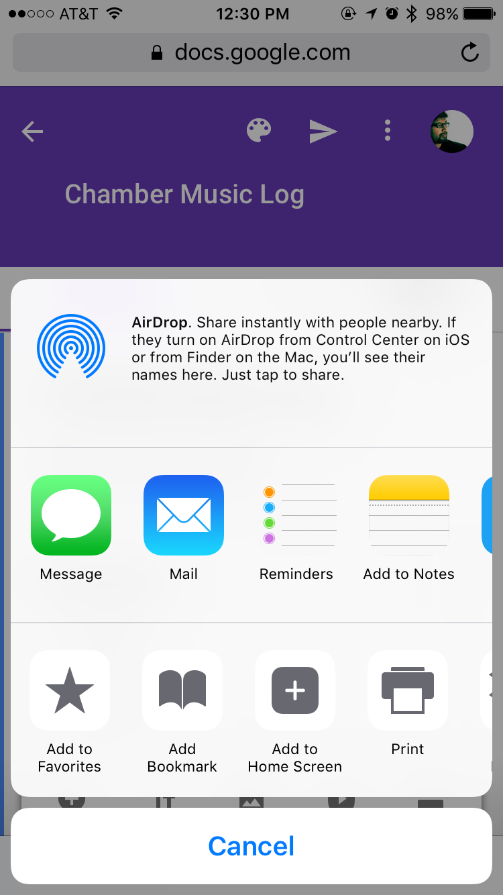
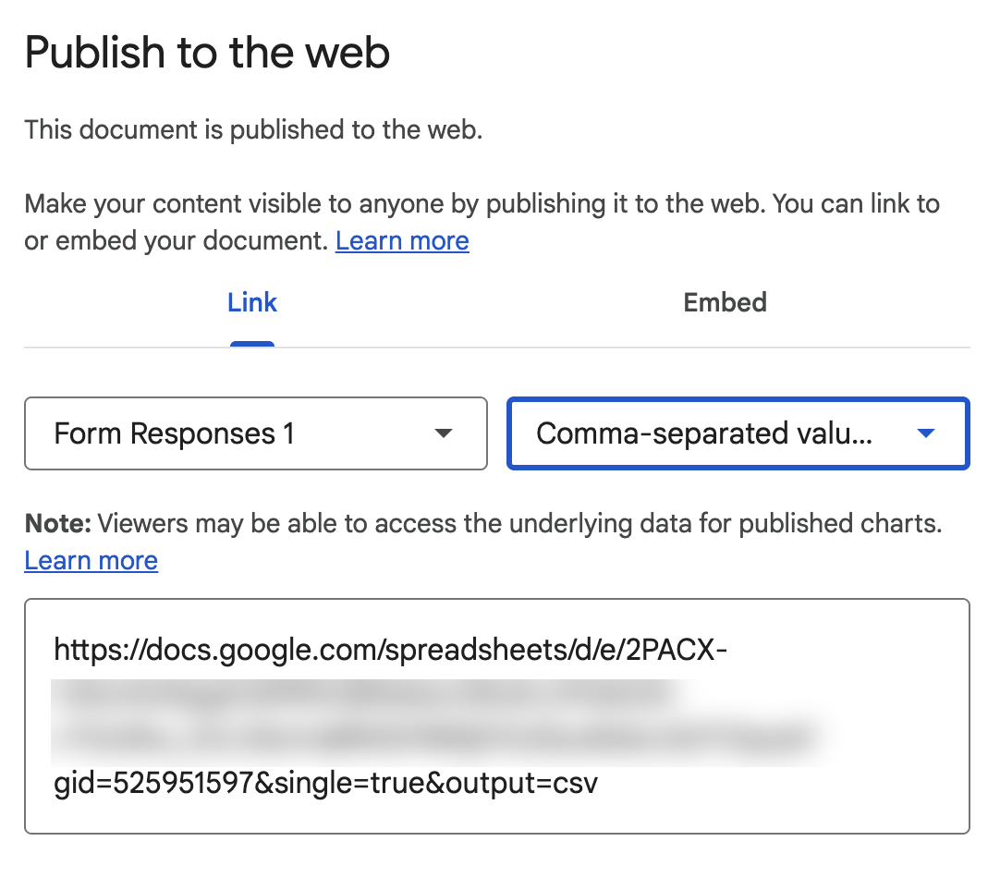

# How to Make a Chamber Music Log

## 1. Create the form

1. Go to [Google Forms](https://docs.google.com/forms/u/0/).

2. Create a new Form.

   {width=600px}

3. Fill it out with the questions you'd like to track. Mine looks like this:

   {width=600px}

## 2. Set up the response sheet

1. Click **Responses**, then the green **Sheets** button.

   {width=600px}

   {width=600px}

2. Name your sheet and click **Create**.

   {width=600px}

## 3. Put the form on your phone

1. Back in the form editor, click the eyeball to preview, then click **Send**.

   {width=600px}

2. In the Send dialog, click the **Link** icon and check **Shorten URL**.

   {width=600px}

3. Open the shortened link on your phone's browser, then choose **Add to Home Screen** from the share menu.

   {width=280px}

## 4. Use it

1. After every piece you play, open the form from your home screen and fill it out — entries are saved straight to the response spreadsheet.

2. Play some Haydn.

3. Repeat.

## 5. View your log

1. In your response sheet, go to **File → Share → Publish to web**. Set the format to **Comma-separated values (.csv)** and click **Publish**. Copy the URL it gives you.

   {width=600px}

2. Open <https://log.quartetroulette.com/> and paste the published-CSV URL into the setup screen.

3. From then on, the site reads your sheet on each visit, so new sessions you log will show up the next time you reload.
