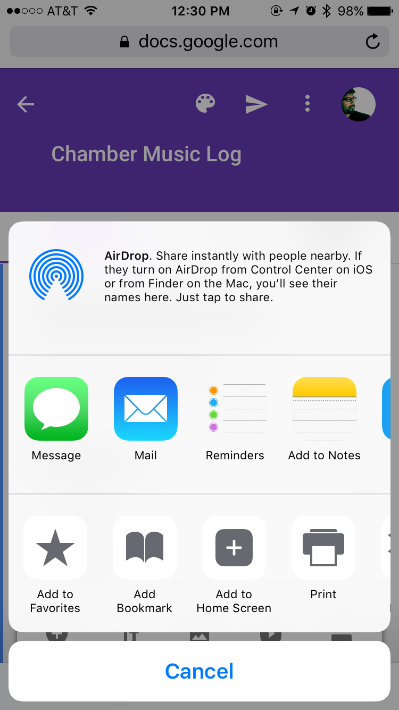
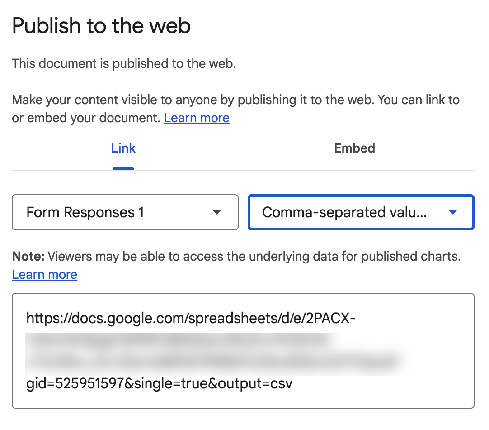

# How to Make a Chamber Music Log

## 1. Create the form

1. Go to [Google Forms](https://docs.google.com/forms/u/0/).

2. Create a new Form.

   {width=600px}

3. Fill it out with the questions you'd like to track. Mine looks like this:

   {width=600px}

**Two things the log site needs from that form**, if you plan to use **Log a
Piece** (section 3) rather than the Google Form itself:

- **Make Composer and Which Part multiple-choice questions, and switch on
  "Other" for both.** Every value the app submits for those two arrives through
  Google's *Other* box, including ones that match an option you listed. It has
  to: your form's option list is on Google's servers and the app cannot read
  it, so it can never know whether the composer you just picked is on it. An
  Other response lands in the response sheet as ordinary text, so the column
  reads exactly the same either way.

  If those questions are short-answer boxes instead, the cell fills with the
  literal text `__other_option__`, and if they are multiple-choice *without*
  Other, Google rejects the whole row. Either way the app still says "Logged",
  because Google's reply to a submission tells it nothing (section 3). You will
  see it on your first piece, so log one and look at the sheet.

- **Everything else can be whatever you like** — the other eight questions are
  read as plain text.

**Cellists: not yet.** The app assumes the person logging is a violinist or
violist, because it has to know which seat is which — playing V1 means Player 3
is the cellist. There is no VC option in **Log a Piece**, so if you play cello
you will have to use the Google Form itself for now. Nothing about the sheet
changes; it is the app that cannot read those rows back correctly yet.

## 2. Set up the response sheet

1. Click **Responses**, then the green **Sheets** button.

   {width=600px}

   {width=600px}

2. Name your sheet and click **Create**.

   {width=600px}

## 3. Put it on your phone

Get the form's link first: in the form editor click **Send**, then the **Link**
icon, and check **Shorten URL**.

   {width=600px}

   {width=600px}

The obvious move is to pin that link: open it on your phone and choose **Add to
Home Screen**.

   {width=280px}

That works, with one irritation. A Google Form ships no web app manifest and no
`apple-mobile-web-app-capable` tag, so iOS treats the pin as an ordinary Safari
bookmark rather than an app: every launch opens another browser tab, and they
pile up.

The log site does ship both, so pinning **it** gives you a real standalone app
with no tabs. Open <https://log.quartetroulette.com/#log> on your phone (set it
up first, section 8) and Add to Home Screen from there. It opens straight to
the **Log a Piece** form.

That form writes to the same spreadsheet through the same Google Form, and it
knows things the form cannot, because the app has your whole log loaded:

- **The composers you actually play are one tap**, ranked by how often you play
  them, with the whole catalogue behind **More…** and free text behind that.
- **Names you have used before autocomplete.** Picking one instead of retyping
  it is what keeps a second Alice from becoming indistinguishable from the
  first (section 7).
- **The seats show who they will repeat.** The greyed name in an empty Player
  field is exactly what a blank will carry forward, so you can see it rather
  than trust it (section 6).
- **Each seat has a part beside it.** When two people swap you change a
  dropdown instead of retyping both names into different columns, and a
  quintet's second viola or cello can be said outright (section 5). The name
  comes along on its own.
- **Extra players stay for the rest of the session** and are written onto every
  piece, so the **x** beside someone is all you do when they leave. That is the
  one column the sheet cannot repeat for you, and the usual way a fifth player
  goes missing (section 6).
- **The work list follows the composer** you picked.
- **It works with no signal.** Everything but the send is local; a piece logged
  in a basement queues up and goes out, in order, when you have a network
  again. You can see what is waiting at the bottom of the form. Nothing you
  have typed is lost either — if the phone kills the app mid-entry, the
  half-filled form is there when you come back.

Either way in works, and both write the same rows.

**Connecting your form.** The site has no form of its own — it writes through
yours, and it has to be told which. The first time you open **Log a Piece** it
asks for a *pre-filled link*, which is where Google Forms puts the field ids:

1. Open your form for editing and choose **⋮ → Get pre-filled link**.
2. Put anything at all in every field, then **Get link → Copy link**.
3. Paste it into the log form's setup panel.

Nothing is submitted by that step: only the ids are read, and they are matched
to your sheet's columns in order, which is the order Forms created them in.
The panel shows you the mapping before you commit to it, so a form whose
questions were reordered after the sheet already existed is something you can
see rather than discover months later.

The connection lives on that device, next to your sheet URL. **Copy setup
link** in the menu carries both, so setting up a second device is one link.

## 4. Use it

1. After every piece you play, open the app or the form from your home screen
   and fill it out — entries are saved straight to the response spreadsheet.

2. Play some Haydn.

3. Repeat.

## 5. Logging anything that isn't a string quartet

The three player fields model a string quartet: you take one seat, and the
other three go in **Player 1**, **Player 2**, **Player 3** — the seats your own
part implies. Playing V1 means Player 1 is V2, Player 2 is the violist, and
Player 3 is the cellist.

Piano trios, piano quartets, quintets and sextets don't fit that shape, so
there are two conventions to keep them straight.

**Use `-` for a seat the work doesn't have.** A piano trio has no second
violin and no viola, so playing violin in one looks like this:

| Which Part | Player 1 | Player 2 | Player 3 | Others? |
|---|---|---|---|---|
| `V1` | `-` | `-` | the cellist | `Alice Hart (p)` |

**Say what someone played with `(instrument)`.** Anyone whose instrument isn't
the one their seat implies needs an annotation — most often the pianist, but
also a cellist you had to seat in a violin field because the pianist took the
cello field. The annotation wins over the seat, so this is correct even though
the pianist is in the cello field:

| Which Part | Player 1 | Player 2 | Player 3 | Others? |
|---|---|---|---|---|
| `V1` | the violist `(va)` | the cellist `(vc)` | the pianist `(p)` | |

Both spellings and shorthands work — `p`, `pf` and `piano` are the same thing,
as are `vc` and `cello`, and `va`, `vla` and `viola`. You can add a comment
after the instrument: `Alice Hart (vc, doubling)` keeps the `vc` and ignores
the rest. Parentheses that name no instrument — `(sub)`, `(guest)`, `(first
time)` — are just notes: they're ignored, and the seat decides as usual.

Pianists, clarinettists and other non-string players are counted as people you
played with, but they're left out of the V1/V2/VA/VC part breakdowns, which
only make sense for string parts.

You can also put the extra player in **Others?** instead — `Alice Hart (p)`
there is read the same way. In the **sheet** these behave differently: the
player fields carry forward within a session, so a slot left blank repeats
whoever was there, annotation included, while **`Others?` does not carry
forward** — six movements with the pianist in Others? is six rows that each
have to name them. Filling rows in the Google Form, that difference decides
which to reach for: a player field for a long session, Others? when the seats
are already full, as in a piano quintet where four string players fill every
slot.

The **Log a Piece** form removes the difference. Extras stay on the form for
the rest of the session and it writes them onto every piece, and both a seat
and an Others? entry get the same instrument dropdown — so you can put people
wherever the ensemble actually puts them, and say what they played without
remembering the `(p)` syntax.

## 6. What repeats itself, and what doesn't

You don't have to retype the same four names for every piece. Leave a player
field **blank** and it repeats whoever was in that seat on your last entry —
annotation included, so `Alice Hart (p)` keeps the `(p)`. Typing a short form
of the name that's already there does the same: `Alice` after `Alice Hart`
means the same person, not a new one.

Three things are worth knowing, because they're the difference between a log
that reads correctly years later and one that doesn't.

**It repeats field by field.** When one player swaps out mid-session, type the
new name in that one field and leave the others blank. The seats you left
alone keep their people. This is what makes a long afternoon of rotating
personnel easy to log — you only ever type what changed.

**Only the player fields and the location repeat. `Others?` does not.** A
fifth or sixth player has to be typed on every row they played. This is the
single most common way a person goes missing from the log, and it's what
`npm run audit` looks for first.

The **Log a Piece** form handles this for you: extra players stay on the form
for the rest of the session and are written out on every piece, so the only
thing you do is press the **x** beside someone when they leave. Entering rows
in the Google Form directly, you're on your own — retype them each time.

**A blank always repeats, however long the break.** Take an hour for dinner
or come back the next morning — a blank field still means "the same person as
last time", because leaving names out is never how you'd start a group. When
a seat is genuinely empty, write `-` rather than leaving it blank; that's how
the sheet tells "nobody here" apart from "same as above".

**A short form only reaches back a few hours.** Typing `Alice` to mean the
`Alice Hart` above works within the same sitting. Weeks later it's read as a
name in its own right, because by then it's just as likely to be a different
Alice — so when you come back to someone after a long time, type the name in
full.

## 7. Naming people

**Type someone's full name the first time you log them.** After that, whatever
you naturally type is fine — first name, nickname, whatever the group calls
them.

The reason is that a first name stops identifying one person the moment a
second Alice turns up, and by then the older entries have no surname to tell
them apart. Reconstructing that later means cross-referencing dates, venues and
who else was in the room, and it gets harder every month. Spending three extra
seconds once is the whole fix.

Short forms are still worth using for the people you play with constantly —
you will never wonder who "Bob" was. The rule is only about the first entry
for someone new.

## 8. View your log

1. In your response sheet, go to **File → Share → Publish to web**. Set the format to **Comma-separated values (.csv)** and click **Publish**. Copy the URL it gives you.

   {width=600px}

2. Open <https://log.quartetroulette.com/> and paste the published-CSV URL into the setup screen.

3. From then on, the site reads your sheet on each visit, so new sessions you log will show up the next time you reload.
