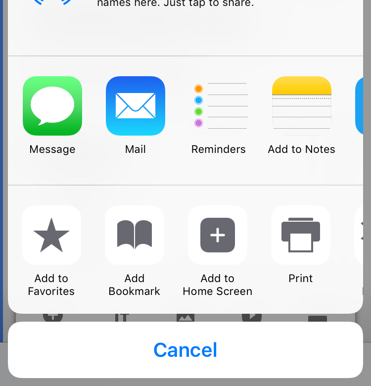
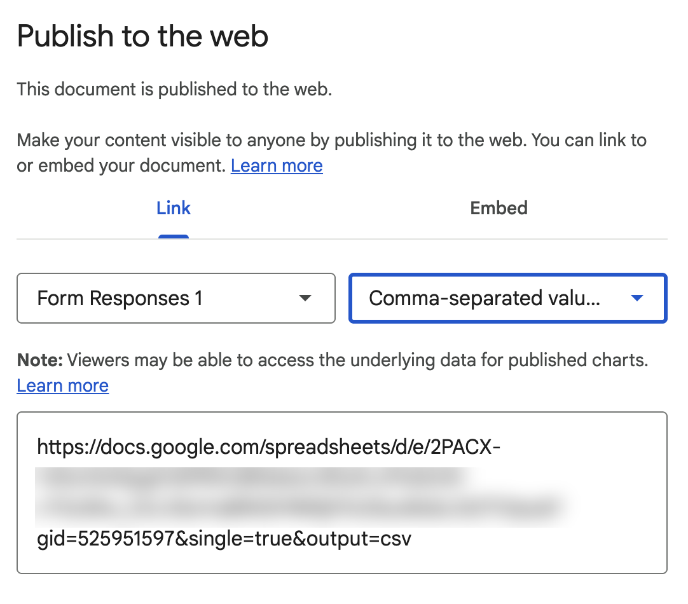

# How to Make a Chamber Music Log

Four parts. Only the first two are needed, and you can stop after either:

1. **[Set up your Google Form](#part-1-set-up-your-google-form)** — the form, and the spreadsheet behind it. This alone is a working log.
2. **[See your log](#part-2-see-your-log)** — point this site at that spreadsheet and it draws your log back. Read-only: nothing is written, and nothing here changes your sheet.
3. **[Filling in the form](#part-3-filling-in-the-form)** — what to type into a row, and what the blanks mean. The same either way you log.
4. **[Log from the app](#part-4-optional-log-from-the-app)** *(optional)* — enter pieces from this site instead of the Google Form. Everything above works without it.

## Part 1: Set up your Google Form

### 1. Create the form

1. Go to [Google Forms](https://docs.google.com/forms/u/0/).

2. Create a new Form.

   {width=208px}

3. Add the questions you want to track. Mine looks like this:

   {width=880px}

Ask whatever you like — the site reads your questions as plain text. Two
exceptions, and they matter only if you plan to log from this site
([part 4](#part-4-optional-log-from-the-app)) rather than the Google Form
itself. Worth getting right now, since
changing a question later means editing the form.

**Composer must be multiple-choice with "Other" switched on.** Every composer
the app submits goes through Google's *Other* box, even one already on your
list. It has to: the list lives on Google's servers where the app can't read
it, and **Other…** in the app takes anything you type anyway. An Other response
lands in the sheet as ordinary text, so the column reads the same either way.

Get it wrong and you'll see it on your first piece. A short-answer Composer box
fills with the literal `__other_option__`. A multiple-choice one *without*
Other makes Google reject the whole row, so nothing arrives. The app says
"Logged" both times, because Google's reply tells it nothing. Log one piece and
check the sheet.

**Which Part needs V1, V2, VA1 and VA2** among its options. Those four are all
the app sends, and it sends them plainly — so multiple-choice or short answer
both work, and Other isn't needed.

**Cellists: not yet.** The app works out the other seats from yours — if you
played V1, Player 3 is the cellist — so there's no VC option in **Log a
Piece**. Use the Google Form for now. Nothing about the sheet changes; it's the
app that can't read those rows back.

### 2. Set up the response sheet

1. Click **Responses**, then the green **Sheets** button.

   {width=767px}

   {width=105px}

2. Name your sheet and click **Create**.

   {width=549px}

### 3. Put the form on your phone

Get the form's link: in the editor click **Send**, then the **Link** icon, and
check **Shorten URL**.

{width=312px}
{width=352px}

{.shot width=375px}
Open that link on your phone and choose **Add to Home Screen**. Then:

1. After every piece, open the form and fill it out. Entries go straight to the
   response spreadsheet.
2. Play some Haydn.
3. Repeat.

That's a complete log — form, spreadsheet, phone. **[Part
3](#part-3-filling-in-the-form)** is what to type into a row; the two parts
either side of it are this site, and are optional.

## Part 2: See your log

This part only reads. The site fetches your published sheet and draws it; it
never writes, and you can stop here and keep entering pieces through the Google
Form forever.

### 4. Publish your sheet

In your response sheet: **File → Share → Publish to web**. Set the format to
**Comma-separated values (.csv)** and click **Publish**. Copy the URL it gives
you.

{width=541px}

Open <https://log.quartetroulette.com/> and paste that URL into the setup
screen. From then on the site reads your sheet on every visit, so new sessions
show up when you reload.

Stuck? [Publishing your sheet as CSV](./setup.html) has the same steps with
troubleshooting.

### 5. Put the app on your phone

Pinning the *Google Form* works, but with one irritation: a Form ships no web
app manifest, so iOS treats the pin as a Safari bookmark rather than an app.
Every launch opens another tab, and they pile up.

The log site does ship one, so pinning **it** gives you a real standalone app:
your calendar and charts, a tap from the home screen. Open
<https://log.quartetroulette.com/> on your phone and Add to Home Screen from
there. (If you take up [part 4](#part-4-optional-log-from-the-app), pin
`/#log` instead and it opens straight to the entry form.)

Setting up a second device doesn't mean retyping the CSV URL — **Copy setup
link** in the menu puts everything this device knows into one link you can
send yourself.

## Part 3: Filling in the form

Whether you type into the Google Form, edit the sheet by hand, or use the app,
a row means the same thing. This is what it means.

### 6. Who goes in which column

**The three player columns are the parts**, and which part each one holds is
decided by yours.

| You play | Player 1 | Player 2 | Player 3 |
|---|---|---|---|
| V1 | V2 | VA | VC |
| V2 | V1 | VA | VC |
| VA1 or VA2 | V1 | V2 | VC |

**A part the piece doesn't have gets a literal `-`.** Not an empty cell — empty
repeats the row above (section 7).

**Everyone past those four goes in `Others?` with a tag:** piano `(p)`, second
viola `(va2)`, second cello `(vc2)`, bass `(bass)`, clarinet `(cl)`. There's
room for a note as well — `Alice Hart (vc, shadowing on IV)`.

When two violinists swap, they trade columns — not tags.

So, by ensemble:

- **String quartet** — the table above.
- **String trio**, you on violin — `-`, the violist, the cellist.
- **Piano trio** — `-`, `-`, the cellist; the pianist in `Others?`.
- **Piano quartet** — the string trio, plus the pianist in `Others?`.
- **Piano quintet** — the quartet, plus the pianist in `Others?`.
- **String quintet, two violas** — the quartet, plus `(va2)` in `Others?`. When
  you're the second viola, it's `Alice Hart (va1)` in `Others?` instead.
- **String quintet, two cellos** — the quartet, plus `(vc2)`. No second viola
  in this one.
- **Sextet** — the quartet, plus `(va2)` and `(vc2)`.
- **Duos and sonatas** — the other player goes in the column that holds their
  part, per the table above; playing V1, that puts a violist in Player 2.
  A part no column holds goes in `Others?`, and the rest get `-`.

**Old rows carry `(instrument)` tags in the columns**, from before this
convention settled. They're still read correctly: the tag beats the column, so a `(p)` in
the cello field still counts as a pianist. Logging over one moves that person
to `Others?` and writes `-` in the column they left.

Spellings are generous. `p`, `pf` and `piano` are the same thing, as are `vc`
and `cello`, and `va`, `vla` and `viola`. Parentheses that name no instrument —
`(sub)`, `(guest)`, `(first time)` — are just notes, and the column decides as
usual.

Pianists, clarinettists and other non-string players count as people you played
with, but they're left out of the V1/V2/VA/VC breakdowns, which only make sense
for string parts.

Logging from the app instead (part 4) means you never arrange the columns
yourself — you say who played what, and it works out the rest.

### 7. What repeats itself, and what doesn't

Leave a player field **blank** and it repeats whoever was in that seat on your
last entry, annotation included — `Alice Hart (p)` keeps the `(p)`. Typing a
short form of a name already there does the same: `Alice` after `Alice Hart`
means the same person, not a new one.

The rest is the difference between a log that reads correctly years later and
one that doesn't.

**It repeats field by field.** One player swaps out mid-session: type the new
name in that field and leave the others blank. The seats you left alone keep
their people, so a long afternoon of rotating personnel is only ever the thing
that changed.

**Only the player fields and the location repeat. `Others?` does not.** A fifth
or sixth player has to be typed on every row they played. This is the single
most common way a person goes missing from the log, and it's the first thing
the data audit looks for. **Log a Piece** handles it — extras stay on the form
for the session and are written out on every piece. Filling in the Google Form
directly, you're on your own.

**A blank repeats however long the break.** An hour for dinner, or the next
morning — a blank still means "the same person as last time", because leaving
names out is never how you'd start a group. When a seat is genuinely empty,
write `-`. That's how the sheet tells "nobody here" from "same as above".

**A short form only reaches back a few hours, and only for names.** `Alice` for
the `Alice Hart` above works within the same sitting. Weeks later it's read as
a name in its own right, because by then it's as likely to be a different
Alice. Coming back to someone after a long time, type the name in full.

**A location is taken exactly as typed. Only a blank repeats.** That's what
lets a room inside a larger place be its own entry: `AKM` after `AKM (chapel)`
gives you `AKM`, not the chapel again.

### 8. Naming people

**Type someone's full name the first time you log them.** After that, whatever
you naturally type is fine — first name, nickname, whatever the group calls
them.

A first name stops identifying one person the moment a second Alice turns up,
and by then the older entries have no surname to tell them apart.
Reconstructing that later means cross-referencing dates, venues and who else
was in the room, and it gets harder every month. Three seconds once is the
whole fix.

Short forms are still worth using for the people you play with constantly —
you'll never wonder who "Bob" was. The rule is only about someone's first
entry.

## Part 4 (optional): Log from the app

### 9. Why log from the app

You can enter pieces here instead of on the Google Form. It writes the same
rows, to the same sheet, through the same form — your form stays the writer and
nothing about the spreadsheet changes. What you get for connecting it is that
the app has your whole log loaded and Google Forms doesn't:

- **The composers you actually play are one tap**, ranked by how often. The
  rest are behind **More…**, and free text behind that.
- **Names you've used autocomplete.** Picking one beats retyping it — that's
  what keeps a second Alice from blurring into the first (section 8).
- **Empty seats show who they'll repeat**, greyed in, so the carry-forward is
  something you see rather than trust (section 7).
- **Each name has its part beside it**, so you never work out which column
  someone belongs in. That one is worth its own paragraph, below.
- **Extra players stay for the session** and go onto every piece, so the **x**
  beside someone is all you do when they leave. That's the one column the sheet
  can't repeat for you, and the usual way a fifth player goes missing
  (section 7).
- **The work list follows the composer** you picked.
- **It works with no signal.** Everything but the send is local. A piece logged
  in a basement queues up and goes out in order when you're back on a network,
  and what's waiting shows at the bottom of the form. A half-typed entry
  survives the phone killing the app.

**Say who played what; the form works out the columns.** Every
name field has a part beside it, and the row your fields will become is drawn
underneath — so a name moving between a column and `Others?` is never out of
sight.

- **Two people swapping is one dropdown.** Set one to the other's part and the
  form trades the pair. Nothing retyped, nothing annotated.
- **A part no column holds** — a second viola, a pianist, an octet's third
  violin — sends that person to `Others?` with the tag, and writes `-` in the
  column they left. It goes the other way too: an extra you set to `v1` is
  written into the column that holds V1.

So a change of personnel is two taps. A fifth player arrives and takes V1 while
you move from violin to viola: set the violist beside you to `va2`, type the
newcomer into `Others?` on `v1`. The row comes out with the violins and cello
in their columns and the second viola as an extra. The piece after that asks
for nothing at all.

**The two dropdowns differ.** A column offers the string chairs — V1, V2, VA,
VA2, VC, VC2, less your own — because the trade it exists for is the one
between two sextets, where everybody shifts within their own family. `Others?`
offers all of those plus V3 and V4 for an octet, VA1 for when you're the second
viola, and bass, piano and clarinet. Anything else — an oboe, a flute — you
type in the parens as always, and the dropdown shows it back rather than
rewriting it. Moving someone *into* a column works from either list, so a
pianist who picks up a violin is one tap. Only the other direction isn't on
offer; there, clear the name and add them as an extra by hand.

### 10. Connect your form

The site has no form of its own. It writes through yours, and has to be told
which. The first time you open **Log a Piece** it asks for a *pre-filled link*,
which is where Forms puts the field ids.

Already done this on another device? **Copy setup link** carries the form as
well as the sheet, so the second device needs neither this step nor section 4.
On your first one:

1. Open your form for editing: **⋮ → Get pre-filled link**.
2. Put anything at all in every field, then **Get link → Copy link**.
3. Paste it into the log form's setup panel.

Nothing is submitted. Only the ids are read, and they're matched to your
sheet's columns in order — the order Forms created them in. The panel shows you
the mapping first, so a form whose questions were reordered after the sheet
existed is something you see now rather than discover months later.

This is also where a Composer question without **Other** starts silently
dropping rows, so log one piece afterwards and check the sheet (section 1).

### 11. Logging a piece

**When you tap Log it**, the form is replaced by a summary of the sitting so
far. **Log the next piece** brings the fields back with the composer, your part
and the seats carried over, so the work title is usually all that's left.

**Why the piece isn't in the charts yet.** It's in your spreadsheet the moment
you tap — the app writes through your Google Form, exactly as filling the form
in by hand would. What lags is the app's *copy*: the calendar and the charts
read the published version Google rebuilds every few minutes, and the app
re-checks every five. So each piece in the summary carries a dot — filled once
the app's copy holds that row, hollow while it's on its way.

The totals underneath are your **last 365 days**, the same window the
calendar's header reports, and they count the whole sitting, hollow dots
included. A year rather than the whole log, because one evening barely moves a
lifetime total: `Unique +1` means a work you haven't played in a year.

A partial movement — anything with a `:` in the title, like `59#1: I` — shows
in *italic*, and its dot never fills. The sheet keeps the row, but the charts
and totals leave it out, so there the dot means only that the entry was sent.

No signal? The summary says so. The piece is held on the device and sent
automatically, in the order you logged them, once you're back on a network.
